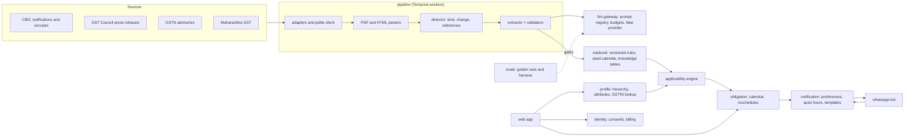

# ComplianceWatch monorepo

> **What is here today.** uv workspace with the FastAPI service template for ten services, the shared
> domain kernel (with the knowledge vocabulary: entity types, seven relation kinds, canonical names;
> the financial year and recurrence value objects) and Ontology 0.2.0 (seventeen GST attributes with
> their hierarchy level and per-financial-year scoping), the rulebook's regulator documents and clauses
> (fixed ids derived from the digest, append-only, a write API the pipeline calls behind a flag,
> the fourth committed OpenAPI spec) and knowledge schema (canonical entities, clause mentions,
> rule relations, citations, rules and versions with the seed calendar of thirteen standing GST
> obligations pending analyst review), KAG-style knowledge extraction behind a flag (a mention
> grammar for notifications, sections, rules, forms, codes, rates, amounts and states; alignment
> to canonical entities with an analyst review queue; relation proposals through a registered
> prompt, validated against the clause text and approved into rule relations by an analyst), the obligation service's domain and use cases
> (obligations per period, deadline changes, withdrawals, row-level security by tenant, events
> through the outbox), the profile service's business hierarchy (entity, registration, location;
> attribute values per node and financial year; snapshots for the engine; one-question onboarding;
> review tasks) behind the second committed OpenAPI spec,
> the LLM gateway skeleton (routing, prompt registry, cost ledger,
> budgets, PII masking, Langfuse tracing, fake provider container) with the first committed OpenAPI
> spec, problem-details errors in py-common, the event contracts (fourteen topics and the envelope as
> JSON Schema with generated pydantic and TypeScript types and compatibility checks in CI), the
> transactional outbox in py-common (writer, Kafka relay with dead letters, idempotent consumer),
> the Temporal worker scaffold with the pipeline's sample ingest workflow, the first source
> adapters (CBIC notifications and circulars, GST Council press releases, GSTN advisories,
> Maharashtra GST notifications) with PDF and HTML parsers, a change detector, a backfill command
> and recorded fixtures, the rule extractor with deterministic validators behind the gateway, the
> labelling tool and the first extraction golden set (50 CBIC notifications listed, one draft
> label), the eval harness with `make eval`, a CI gate and a nightly run, the WhatsApp bot with
> signature checks, keyword opt-in and opt-out and Hindi replies, the notification service's
> preferences, quiet hours, template drafts and Cloud API channel behind a flag, consent records
> in the identity service with the legal drafts in `docs/legal`, the GSTIN lookup protocol with
> the manual fallback, the billing protocol with a Razorpay skeleton behind a flag, OpenTelemetry tracing
> and metrics with a dev observability stack (collector, Prometheus, Tempo, Grafana dashboard),
> pnpm + Turborepo workspace with the Next.js web app and
> the WhatsApp bot, paging alert rules with runbooks and a CI link check, dev backup and restore, the MVP deploy profile (Fly.io templates, Vercel config, env matrix) and the one-process demo tenant (`make demo`), Docker Compose dev stack, GitHub Actions CI, pre-commit hooks and ADRs 001 to 008
> and 012 to 018 (009 to 011 as stubs). No product features yet. Start at [docs/onboarding/local-dev.md](docs/onboarding/local-dev.md).
>
> Source of truth: *ComplianceWatch - Project Foundation (HLD, LLD & Build Guide)*. Section numbers below refer to that guide.
>
> Architecture reference: [docs/ComplianceWatch-Architecture.pdf](docs/ComplianceWatch-Architecture.pdf) (v1.0, September 2026) is the current design summary; its decision log numbers the ADRs.

ComplianceWatch watches regulators for rule changes, decides which changes apply to one specific business, and turns each into a dated obligation the owner can act on. Launch vertical: Indian SMBs under GST, with FSSAI as the second regulator (section 1).

Repository policies: [LICENSE](LICENSE) (all rights reserved), [SECURITY.md](SECURITY.md) for reporting a vulnerability, [CONTRIBUTING.md](CONTRIBUTING.md) for the branch, commit and layering rules.

## How the pieces fit



Events between services travel through the transactional outbox and Redpanda (topics in
`packages/contracts/events`); every model call goes through the llm-gateway; every tenant
table has row-level security. `make demo` walks a demo business through the right-hand side of
the diagram in one process ([docs/onboarding/demo.md](docs/onboarding/demo.md)).

## Getting started

```bash
cp .env.example .env          # placeholder values; never commit .env
make install                  # uv sync --all-packages + pnpm install --frozen-lockfile
make dev                      # Postgres+pgvector, Redis, Redpanda, Temporal (+UI) via Docker Compose
make migrate                  # alembic upgrade head for every service, one schema each
make run SERVICE=identity     # http://localhost:8001/health (ports 8001-8010, table below)
make run SERVICE=llm-gateway  # http://localhost:8008/v1/llm-gateway/completions with the fake provider
make test                     # pytest with the coverage gate + vitest
make check                    # the CI gates: lint, typecheck (incl. tests), test, import-linter, lock check
```

Prerequisites: Node 22.18+ (type stripping for the bot's dev script), Docker (Docker Desktop or `brew install colima docker docker-compose docker-buildx && colima start --cpu 4 --memory 8 --disk 60`), `uv`, `pnpm` and Node 22+. Details and troubleshooting in [docs/onboarding/local-dev.md](docs/onboarding/local-dev.md).

## Layout principles (section 13)

One monorepo, one directory per service, one shared contracts package that every service builds against, and a `CODEOWNERS` file that maps each directory to exactly one team. A change to a contract needs a review from every consuming team; a change inside a service needs only its owner.

## Repository tree

```
compliancewatch/
  apps/
    web/                     # Next.js 16: owner portal, CA dashboard, /admin internal tools
    whatsapp-bot/            # Webhook receiver and conversation state (TypeScript, Hono)
  services/                  # One FastAPI or worker service per directory (Python)
    identity/
    profile/
    rulebook/
    applicability-engine/
    obligation/
    notification/
    qa/
    llm-gateway/             # routing, prompt registry, cost ledger, budgets, PII masking, tracing (ADR-008)
      prompts/               # registry.toml: every prompt with a version, an owner and an eval case
    eval/
    pipeline/                # crawler, detector, parser, extractor, review as Temporal workers
      src/pipeline/workflows/  # ingest_document: the sample workflow; worker.py runs the worker
      src/pipeline/infrastructure/adapters/  # one SourceAdapter per regulator site; registry.py
      src/pipeline/infrastructure/parsers/   # PDF and HTML parsers, language detection
      src/pipeline/backfill.py  # pipeline-backfill: make backfill SERVICE=pipeline ARGS=...
      src/pipeline/label.py     # pipeline-label: golden extraction cases (make label ARGS=...)
      src/pipeline/application/{extractor,validators}.py  # the extractor behind the gateway and its checks
      prompts/               # extraction.rule_candidate.v1.md; digest recorded in the gateway registry
      adapters/, parsers/    # pointers to the package directories above
      prompts/               # Versioned prompt files, each with a test
      workflows/             # pointer to src/pipeline/workflows
  packages/
    contracts/               # OpenAPI specs, event schemas (JSON Schema), generated clients (py + ts)
      openapi/               # llm-gateway.v1.json and profile.v1.json
      events/                # schemas/<topic>.v1.json, examples/, CHANGELOG.md (fourteen topics + envelope)
      clients/python/        # cw_contracts: generated pydantic models (make contracts)
      clients/typescript/    # generated .d.ts per topic and index.ts
    domain-kernel/           # Shared value objects, protocols, ontology model, error types
    ontology/                # GST attribute definitions as YAML (0.2.0), loader and validator
    py-common/               # Settings, logging, telemetry, health routes, problem details, app factory, event envelope, outbox, Temporal scaffold
    ui/                      # Shared React components and design tokens
  infra/
    terraform/               # AWS modules: network, EKS, Aurora, MSK, S3, IAM
    helm/                    # One chart per service, values per environment
    argocd/                  # Application definitions
    dev/                     # Docker Compose dev-stack assets (init SQL, Temporal dynamic config, collector, Prometheus + alerts, Tempo, Grafana)
    deploy/                  # MVP deploy profile: Fly.io app templates per service, Vercel for the web app, the env matrix
    scripts/                 # check_alert_runbooks.py: every alert links a runbook (make runbooks-check)
  docs/legal/                # Draft privacy notice, terms, WhatsApp consent, data map, consent record (to be reviewed by a lawyer)
  tools/
    demo/                    # Workspace package cw_demo: the demo tenant end to end (make demo)
  evals/
    golden/                  # Golden sets: extraction/cbic_notifications (index + cases), qa/, applicability/
    harness/                 # Workspace package cw_evals: runner, metrics, thresholds (make eval)
  docs/
    adr/                     # Architecture decision records (001 to 008 and 012 to 017 written; 009 to 011 stubs)
    runbooks/
    onboarding/              # local-dev.md
  .github/workflows/         # ci.yml (lint, typecheck, tests, dev-stack smoke, gitleaks), pr-checks.yml
  docker-compose.yml         # Postgres 16 + pgvector, Redis 7, Redpanda, Temporal, Langfuse and fake-llm (profiles)
  .env.example               # every variable the stack and the services read
  pyproject.toml, uv.lock    # uv workspace root: dev dependency group and all Python tool config
  package.json, pnpm-workspace.yaml, turbo.json   # pnpm + Turborepo workspace
  .pre-commit-config.yaml    # ruff, prettier, gitleaks, conventional commits
  CODEOWNERS
  Makefile                   # make help lists every target
```

## Inside every Python service (identical shape)

```
services/<name>/
  src/<package>/
    api/            # routers, schemas, dependencies
    application/    # use cases, event handlers, unit of work
    domain/         # entities, value objects, events, repositories (protocols)
    infrastructure/ # sqlalchemy models, repositories, kafka, adapters
    main.py         # composition root: create_app(...) from py-common
  migrations/       # alembic (env.py reads CW_DATABASE_URL and CW_DB_SCHEMA)
  tests/
    unit/           # domain and application with fakes; no I/O
    integration/    # testcontainers: postgres, kafka
    contract/       # provider-side contract tests for this service's API and events
  alembic.ini
  pyproject.toml    # compliancewatch-<name>; depends on py-common (workspace)
  Dockerfile        # multi-stage uv build, non-root runtime on port 8000
  README.md         # what it owns, how to run, who owns it
```

Every service exposes `GET /health` (liveness) and `GET /ready` (readiness) from `py_common`, and `GET /v1/<name>/ping` from its own router. Every error leaves as `application/problem+json` (RFC 9457) with a stable `type` URI and the request's `correlation_id`; a service maps its own domain errors to statuses in `create_app(problem_status=...)`. Python package names are the directory name with hyphens replaced by underscores, with two exceptions chosen so the package never shadows the standard library or a builtin:

| Service directory | Package | Dev port (`make run`) | Postgres schema |
| --- | --- | --- | --- |
| `identity` | `identity` | 8001 | `identity` |
| `profile` | `profile_service` (the stdlib ships a `profile` module) | 8002 | `profile` |
| `rulebook` | `rulebook` | 8003 | `rulebook` |
| `applicability-engine` | `applicability_engine` | 8004 | `applicability` |
| `obligation` | `obligation` | 8005 | `obligation` |
| `notification` | `notification` | 8006 | `notification` |
| `qa` | `qa` | 8007 | `qa` |
| `llm-gateway` | `llm_gateway` | 8008 | `llm_gateway` |
| `eval` | `eval_service` (`eval` is a builtin) | 8009 | `eval` |
| `pipeline` | `pipeline` | 8010 | `pipeline` |

`services/pipeline/{adapters,parsers,prompts,workflows}` sit directly under the service, as drawn in section 13; the CI eval trigger (section 17) watches `services/pipeline/prompts`. The code for adapters, parsers and workflows lives under `src/pipeline/` so it is importable; the root directories hold pointers.

## Ownership (section 14)

`CODEOWNERS` maps every directory to its owning team. GitHub teams do not exist yet, so every line names the repository owner and records the intended team in a comment. Teams: Regulatory Intelligence, AI Platform, Core Product, Platform and Infrastructure, Identity and Partner, and the Regulatory Analysts (domain). Until those teams are staffed, two combined teams cover them: Platform and Pipeline, and Product and AI.

## Make targets (section 13)

| Target | What it does |
| --- | --- |
| `make dev` / `dev-observability` / `dev-llm` / `dev-down` / `dev-reset` / `dev-logs` / `dev-ps` / `dev-psql` | Docker Compose dev stack (section 17); `dev-observability` adds Langfuse, the OpenTelemetry collector, Prometheus, Tempo and Grafana (http://localhost:3030), `dev-llm` builds and starts the fake LLM gateway container |
| `make migrate [SERVICE=x]` | `alembic upgrade head` for every service (or one), each in its own schema |
| `make run SERVICE=x [PORT=n]` | uvicorn with reload on the service's dev port; an explicit environment variable beats `.env` |
| `make openapi SERVICE=x` | Export the service's OpenAPI spec to `packages/contracts/openapi/<x>.v1.json` (checked by a contract test) |
| `make contracts` / `contracts-check` | Regenerate the event clients from `packages/contracts/events/schemas`; check the schemas and that the committed clients match |
| `make relay SERVICE=x` | Run the outbox relay for one service's schema against the dev stack |
| `make worker SERVICE=x` | Run the service's Temporal worker (`python -m <package>.worker`) against the dev stack |
| `make seed SERVICE=rulebook [ARGS=--check]` | Validate the seed calendar, or load it as draft rule versions into the rulebook schema |
| `make test` | pytest (unit + contract, coverage gate on domain and application) and vitest |
| `make lint` / `typecheck` / `format` | ruff + eslint + prettier; mypy --strict + tsc --strict |
| `make check` | lint, typecheck, test, import-linter, uv lock check, contracts check (the same gates CI runs) |
| `make eval` | Eval harness against `evals/golden`: `EVAL_PROFILE=ci` (default, no tokens) or `nightly` (a real model behind the gateway) |
| `make label` | Labelling tool for the extraction golden set: `ARGS="check"`, `"index ..."`, `"prepare ..."` |
| `make demo` | The demo tenant end to end in one process: consent, profile, rules, obligations, a reminder ([docs/onboarding/demo.md](docs/onboarding/demo.md)) |
| `make runbooks-check` | Every Prometheus alert links an existing runbook (part of `make check`) |
| `make dev-backup` / `dev-restore FILE=` | pg_dump and pg_restore of the dev database ([docs/runbooks/backup-restore.md](docs/runbooks/backup-restore.md)) |
| `make hooks` | Install the pre-commit and commit-msg hooks |
| `make help` | Every target with its description |

## Conventions enforced by tooling (section 13)

| Convention | Enforced by | Status |
| --- | --- | --- |
| No import from another service's package | import-linter contract in CI | wired |
| Domain layer imports nothing from infrastructure or third-party I/O | import-linter | wired |
| Every public endpoint has an OpenAPI schema and a contract test | CI job fails on undocumented routes | partly: the llm-gateway, profile, identity and rulebook specs are committed under `packages/contracts/openapi` and a contract test per service fails when the served schema drifts (`make openapi`); the other services still have only ping routes |
| Every event has a JSON Schema in packages/contracts and a changelog entry | Schema registry compatibility check in CI | wired: metaschema, golden examples, generated clients in sync, base-branch examples replayed against the new schemas, and `rpk registry schema check-compatibility` in the dev-stack job (the gateway's two log-only events get schemas with their first consumer) |
| Every prompt file has a version, an owner and at least one eval case | Eval harness refuses to run an unregistered prompt | partly: the gateway refuses a prompt that is not in `services/llm-gateway/prompts/registry.toml`; the eval harness is not built |
| Every table with tenant data has tenant_id and an RLS policy | Migration lint script | partly: the obligation and profile tables carry forced policies proven by integration tests through a non-superuser role; the lint script is not written (`llm_gateway.cost_ledger` is cross-tenant metering and has no RLS on purpose) |
| Conventional commits; squash merge; PR template with risk and rollback sections | pre-commit commit-msg hook, PR title check, PR template | wired (branch protection is a repo setting) |
| Type checking is strict on both sides | mypy --strict, tsc --strict | wired |
| Test coverage floor 80% on domain and application layers | pytest-cov gate | wired |
| Secrets never in the repo | gitleaks pre-commit and CI | wired |

## Deviations from the guide

- `apps/web` uses **Next.js 16** (current release) rather than the "Next.js 15" named in section 12; Turbopack is the default and `next lint` is gone, so linting is the separate `lint` task.
- Environment variables read by services carry the `CW_` prefix (`CW_DATABASE_URL`, `CW_DB_SCHEMA`, ...); compose-only variables (`POSTGRES_*`, ports, `LANGFUSE_*`) stay unprefixed. See `.env.example`.

## Where to read more in the guide

- Section 5: high-level design and the two core flows
- Section 7: low-level design per service (owns, consumes, emits, failure handling)
- Section 8: AI and ML layer, RAG design, eval thresholds
- Section 10: public API v1 and webhooks
- Section 12: tech stack
- Section 13: this structure and the conventions above
- Section 14: teams, contracts and decision rights
- Section 15: internal tools under /admin
- Section 17: environments, CI pipeline, release process
- Section 19: testing and quality strategy
- Section 20: phased roadmap
- Section 21: risks, open questions, decision log (ADRs in `docs/adr/`)

## Not in this repository yet

- Terraform staging cluster and Keycloak (the gateway trusts an `x-tenant-id` header until then)
- Accounts the maintainer opens: the Meta WhatsApp business account (bot and channel stay in logging mode), Razorpay (billing answers 503), a GSTIN lookup provider (every registration gets a verify task), Supabase Auth; the legal drafts need a lawyer before onboarding shows them
- Postgres tables for notification preferences and the sent log (in memory now); the email channel (SES)
- A service that writes to the outbox (the writer, relay and consumer exist in py-common; the first producer adds the `outbox_event` migration)
- Alert rules for source freshness, decision-flip rate, notification failures and LLM budget (their metrics do not exist yet; the API SLO, outbox and worker alerts do, with runbooks)
- The EKS path of the guide (Terraform, Helm, Argo CD canaries); the MVP profile in `infra/deploy` targets Fly.io and Vercel and has not been applied
- The ingest workflow wired to the real adapters and the outbox (the adapters, parsers and detector exist and run from `make backfill`; the workflow still runs on the in-memory fakes); OCR for scanned PDFs
- The 50-document sample rulebook (the seed calendar of standing obligations exists, pending analyst review)
- Prompt texts for judgement, question answering and classification (extraction exists); the qa and applicability golden sets and their harness suites
- Analyst labels: 45 of the 50 listed CBIC notifications have no case yet, and the five case files (01/2026 with a draft label; 17/2025, 15/2025, 10/2025 and 13/2024 with clauses and detector output only) are unreviewed; the nightly eval needs the `CW_AI_GATEWAY_API_KEY` repository secret
- Full text for ADR-009 to ADR-011; the identity service itself (ADR-014 decides Supabase Auth for the MVP; nothing is created until the maintainer opens the project)
- KAG-style reasoning beyond extraction: the logical-form planner and solver in qa and its eval gate (ADR-017); a publish flow that turns approved candidates into published versions and events; an alert on the entity review queue
