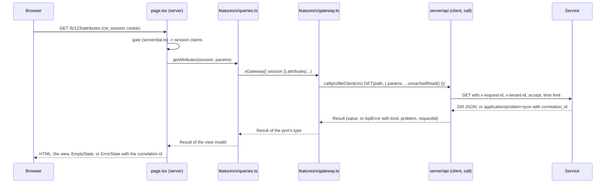

# Data layer

How the web app talks to the services. The rule comes from
[ADR-019](../adr/ADR-019-web-server-layer-and-stateless-session.md): the browser never calls a
service; every call is made on the Next.js server through `apps/web/src/server`, where every
file starts with `import "server-only"`. This page is the working detail: the generated types,
the clients and their headers, how an answer becomes a `Result`, what a page and a form do with
a failure, caching, idempotency, the shared secrets, and the local services with their seed.
Who is asking (the session and the gates) is in [auth-and-roles.md](auth-and-roles.md).

On `main` no screen reads a service yet: the layer is in place and tested, the sign-in feature
uses its `Result` and `ActionState` types, and the seed script fills the services through
clients typed the same way. The first data screens copy the shape described under "A feature
that reads data".

## Request flow



A form posts to a server action instead: the action parses the form, runs the gate again (the
proxy is not on an action's path), calls the gateway, maps the `Result` to an `ActionState`,
and on success invalidates what it changed before it redirects. Nothing on that path runs in the
browser except the form and its pending state.

## Generated types

`make openapi-ts` writes `packages/contracts/clients/typescript/openapi/<service>.v1.d.ts` for
every committed spec (`identity`, `llm-gateway`, `notification`, `obligation`, `profile`, `qa`,
`rulebook`) with `openapi-typescript`, formatted with prettier, plus an `index.ts` that exports
each file as a namespace (`identity`, `llmGateway`, `notification`, `obligation`, `profile`,
`qa`, `rulebook`). `make openapi-ts-check` (in `make check` and in the `web-e2e` CI job)
regenerates in memory and fails on any difference, so a spec change lands with its types. App
code imports them type-only:

```ts
import type { profile } from "@compliancewatch/contracts/openapi";
type Snapshot = profile.components["schemas"]["SnapshotOut"];
```

`applicability-engine`, `eval` and `pipeline` have no committed spec, so the app has no client
for them; a screen that needs one of their routes is a waiting entry in the registry until the
spec lands. There is no hand-written or untyped client.

## Configuration

Everything comes from `server/env.ts` (`getEnv()`, parsed with zod at the first request, never
at build time; `loadEnv(record)` in tests). The data layer reads:

| Variable                      | Default                             | Meaning                                                                                  |
| ----------------------------- | ----------------------------------- | ---------------------------------------------------------------------------------------- |
| `CW_WEB_<SERVICE>_URL`        | `http://localhost:8001` ... `:8010` | one per service, in the Makefile's `SERVICES` order; a trailing slash is dropped         |
| `CW_WEB_REQUEST_TIMEOUT_MS`   | `10000` (at most `120000`)          | the time limit of every call; past it the call is a `network` error                      |
| `CW_WEB_RULEBOOK_WRITE_TOKEN` | unset                               | the rulebook's `x-cw-write-token`; unset means the write client answers "not configured" |
| `CW_WEB_SEED_STATE_PATH`      | `../../var/seed/last.json`          | the file the seed writes, relative to `apps/web`; the sign-in form offers its tenant     |

`<SERVICE>` is `IDENTITY`, `PROFILE`, `RULEBOOK`, `APPLICABILITY_ENGINE`, `OBLIGATION`,
`NOTIFICATION`, `QA`, `LLM_GATEWAY`, `EVAL` or `PIPELINE`. A second working copy puts its
`http://localhost:9201` ... `:9210` values in `apps/web/.env.local`. `apps/web/.env.example`
lists every variable; none is `NEXT_PUBLIC_*`.

## Clients and headers

`server/api/client.ts` builds one `openapi-fetch` client per call site with
`createServiceClient<Paths>({ service, baseUrl, timeoutMs, fetchImpl?, headers? })`.
`server/api/services.ts` holds the factories the gateways use; each takes a `ClientContext`
`{ session, tenantId?, fetchImpl? }`:

| Factory                                       | Service      | Tenant header                     | Other headers                                     |
| --------------------------------------------- | ------------ | --------------------------------- | ------------------------------------------------- |
| `identityClient(ctx)`                         | identity     | yes                               |                                                   |
| `profileClient(ctx)`                          | profile      | yes                               |                                                   |
| `notificationClient(ctx)`                     | notification | yes                               |                                                   |
| `llmGatewayClient(ctx)`                       | llm-gateway  | yes                               |                                                   |
| `obligationClient(ctx)`                       | obligation   | yes                               |                                                   |
| `qaClient(ctx)`                               | qa           | yes                               |                                                   |
| `rulebookClient(ctx?)`                        | rulebook     | never (records shared by tenants) |                                                   |
| `rulebookAdmin(ctx)` returns `Result<Client>` | rulebook     | never                             | `x-cw-write-token`, after a regulatory-role check |

Every request carries:

- `x-request-id`: a fresh UUID per call (a cached read sends `cached:<tags>`, see below). The
  services log it and echo it as the problem's `correlation_id`; `call()` returns it with the
  value or the error, and `ErrorState` shows it.
- `accept: application/json`.
- `x-tenant-id`: `ctx.tenantId ?? ctx.session?.tenantId` on the tenant-scoped services, and
  nothing when neither is set. The `tenantId` override is the only way a request acts for a
  tenant other than the session's, and only admin lookups use it.
- The time limit: `AbortSignal.timeout(CW_WEB_REQUEST_TIMEOUT_MS)`, combined with the request's
  own signal.

Body fields that record who did something (`decided_by`, `recorded_by`, `changed_by`, `by`) are
filled from `session.userId` by the gateway, never from the form; every write follows that
rule.

## Calling a service: `call()` and `Result`

```ts
const plans = await call(
  identityClient(ctx).GET("/v1/identity/billing/plans", cachedRead([tags.identity.plans()])),
);
if (!plans.ok) return plans; // an ApiError: kind, status, problem, requestId, message
use(plans.value);
```

`call(promise)` turns the client's `{ data, error, response }` into
`Result<T> = { ok: true, value, requestId? } | { ok: false, error: ApiError }`
(`server/result.ts`, with `ok`, `err`, `mapResult`, `unwrapOr`). A 2xx is `ok` (a 204 has no
value); any other status is an `ApiError` from the status and the problem body; a refused
connection, a DNS failure or the time limit is `kind: "network"` with the request id it would
have sent. `call` never throws for those; anything else it catches is a bug and propagates to
the segment's error boundary.

## Errors

Every service answers errors as RFC 9457 `application/problem+json` (`py_common.problems`):
`type` (`urn:compliancewatch:problem:<slug>`, or `about:blank`), `title`, `status`, `detail`,
`instance`, `correlation_id` and, on a 422, `errors[]` with `loc`, `msg` and `type`. Every
committed spec publishes the same `Problem` schema (`entities/problem/types.test.ts` checks
it), so `entities/problem/types.ts` takes the identity spec's generated type for all of them.
`server/api/problem.ts` reads the body tolerantly: a proxy or a crashed process may answer
plain text, which leaves `problem` unset and the kind still follows the status.

| Status      | `ApiError.kind`                  | What the page or form does                                                    |
| ----------- | -------------------------------- | ----------------------------------------------------------------------------- |
| 401         | `unauthenticated`                | sign in again (`/sign-in?next=`)                                              |
| 402         | `payment_required`               | say the billing plan does not include it; link to billing                     |
| 403         | `forbidden`                      | say access is missing; `identity-mfa-required` will lead to the second factor |
| 404         | `not_found`                      | a page may call `notFound()`; a form shows the problem                        |
| 409         | `conflict`                       | an inline message: reload and try again                                       |
| 413, 415    | `too_large`, `unsupported_media` | an inline message on the upload                                               |
| 422         | `validation`                     | `fieldErrors` per field, the rest as the form's problem                       |
| 428         | `precondition_required`          | `ErrorState` with the problem: the action left out the `Idempotency-Key`      |
| 429         | `rate_limited`                   | wait `retryAfterSeconds` (from `Retry-After`, seconds or an HTTP date)        |
| 503         | `unavailable`                    | the service or a feature of it is off; say so, with the problem's detail      |
| other 5xx   | `server`                         | `ErrorState` with the correlation id                                          |
| other 4xx   | `bad_request`                    | `ErrorState` with the problem                                                 |
| no response | `network`                        | "The service could not be reached" (or did not answer within the time limit)  |

`ApiError.message` is the problem's title, or a default sentence for the kind. `isProblem(error,
"identity-mfa-required")` tests the type's slug, never the title.

**Field errors.** A 422's `errors[].loc` becomes a dotted field path with the source dropped:
`["body", "gstin"]` is `gstin`, `["body", "changes", 0, "value"]` is `changes.0.value`, a bare
`["body"]` stays `body`, and several messages for one field keep their order
(`fieldErrorsFromIssues`). A form names its inputs with the same paths, so
`fieldErrorOf(state, "gstin")` finds the message.

**Web-local problems.** A failure the server layer decides before any request (a missing
configuration, a refused role, a sign-in the fake provider rejects) is `webError(kind, slug,
title, detail?, fieldErrors?)`: the same `ApiError` shape with a problem typed
`urn:compliancewatch:problem:web-<slug>` and no request id, since no service was called. The
ones on `main`: `web-write-token-missing`, `web-regulatory-role-required`,
`web-auth-provider-missing`, `web-auth-provider-not-implemented`, `web-fake-sign-in-invalid`,
`web-fake-provider-no-challenge`, `web-fake-provider-input`, and
`web-cross-origin-request` from the sign-out handler. In a form, a failure that came without a
problem body (a refused connection, a proxy's plain-text 502) is typed `web-<kind>`, for
example `web-network`, by `toActionProblem`.

**What a page shows.** `if (!result.ok) return <ErrorState ... />` with the error's title, the
problem's detail, the status and the correlation id (in `<code>` with a copy button); an empty
list is `EmptyState` with the reason it is empty, never a placeholder row. Raw service detail
never appears without the correlation id beside it.

## Server actions and `ActionState`

A form's server action returns `ActionState<T>` (`shared/lib/action-state.ts`, isomorphic so the
client form can read it):

```ts
type ActionState<T> =
  | { status: "idle" }
  | { status: "ok"; value?: T; message?: string }
  | {
      status: "error";
      problem?: ActionProblem;
      fieldErrors?: FieldErrors;
      formErrors?: readonly string[];
    };
```

`ActionProblem` is `{ type, title, detail?, correlationId? }`. `toActionState(result, {
message? })` maps a service `Result`; `fieldFailure(fieldErrors)` answers a shape check that
failed before any call; `actionFailure(formErrors)` a form-level refusal (a flag that is off, a
missing precondition). Every action:

1. is in `features/<feature>/actions.ts` under `"use server"`, never in a page file;
2. parses the `FormData` with a zod schema (shape only; the service owns the rules);
3. runs the gate again (`requireRole`, `requireAdmin`), because the proxy never sees an action;
4. checks its flag where the screen is gated;
5. calls the gateway and maps the `Result`; an expected failure is returned, never thrown;
6. on success calls `afterMutation({ tags, paths })` and then `redirect()` where the flow moves on.

`features/auth/actions.ts` (`signIn`) is the example on `main`. The form uses `useActionState`,
disables its submit button while pending (`aria-busy`), and announces the result in a
`role="status"` region.

React resets a form's uncontrolled fields once its action returns, a refusal included, and a
controlled `<select>` keeps its state while the reset moves the element back to its first
option. A form that must show what was sent after a refusal therefore wraps the server action
in its `useActionState` reducer, records the submitted values and a submit count next to the
`ActionState`, and remounts its fields (keyed by the count) with those values as defaults;
`features/auth/ui/dev-sign-in-form.tsx` is the example. After a refusal it moves focus to the
error summary, since the disabled submit button has dropped it.

## Caching and revalidation

Tenant data is never cached; a handful of records every tenant sees the same way are
(`server/cache.ts`, decision D-018).

| Read                                                          | Fetch options                                       | Tag builder                                                                           |
| ------------------------------------------------------------- | --------------------------------------------------- | ------------------------------------------------------------------------------------- |
| billing plans                                                 | `cachedRead([tags.identity.plans()])`               | `identity:plans`                                                                      |
| rulebook rules                                                | `cachedRead([tags.rulebook.rules()])`               | `rulebook:rules`                                                                      |
| a rulebook document                                           | `cachedRead([tags.rulebook.document(id)])`          | `rulebook:document:<id>`                                                              |
| the entity and relation review queues                         | `cachedRead([tags.rulebook.reviewEntities()])`, ... | `rulebook:review-entities`, `rulebook:review-relations`                               |
| notification templates                                        | `cachedRead([tags.notification.templates()])`       | `notification:templates`                                                              |
| the ontology (`server/ontology.ts`)                           | `cachedRead([tags.profile.ontology()], 3600)`       | `profile:ontology`                                                                    |
| gateway prompts and models                                    | `cachedRead([tags.llm.prompts()])`, ...             | `llm-gateway:prompts`, `llm-gateway:models`                                           |
| anything keyed by the tenant (profile, consents, obligations) | `uncachedRead()` (`cache: "no-store"`)              | none; `tags.identity.consents` and `tags.profile.node` exist, the reads stay uncached |

`cachedRead(tags, seconds = 300)` gives the call `next: { revalidate, tags }`; it refuses an
empty tag list, since nothing could invalidate the entry. Tags are built only through
`tags.*` (`service:record[:part]`, no empty part, no `:` inside a part, at most 256
characters; a bad tag throws), so an action and the reads it affects agree on the string.

Next 16's cache functions, as the app uses them:

- `updateTag(tag)`: in a server action only; expires the tag so the next read waits for fresh
  data (read-your-writes). `afterMutation({ tags })` calls it.
- `revalidatePath(path)`: refreshes a route's render on its next request.
  `afterMutation({ paths })` calls it.
- `revalidateTag(tag, "max")`: the stale-while-revalidate form for route handlers and
  background refreshes. Not used on `main`.
- `cacheComponents` and `"use cache"` are off (D-004).

Authenticated pages export `dynamic = "force-dynamic"`; Next still honours an explicit
`next.revalidate` on a fetch inside such a page. Next keys a fetch cache entry on the request
headers too, so a cached read sends `x-request-id: cached:<tags>` instead of a fresh UUID, and
reads with the same tags and headers share one entry: one for a rulebook read (no tenant
header), one per tenant for a global read from a tenant-scoped service such as the billing
plans. A cached read's correlation id therefore names the tags rather than one request. No
cached read sends `Authorization` or a cookie.

## The ontology

Every word a screen shows about a profile attribute comes from the profile service's
`GET /v1/ontology`: the question onboarding asks, the help line, the label of each allowed value,
the attribute's level, type and source, and the operators a rule may use on each type. There is
no copy of the ontology in the web app. `server/ontology.ts` reads it without a tenant header
(the ontology is the same for every tenant) and caches it under `profile:ontology` for an hour,
the lifetime the service states in its `Cache-Control`; `getOntology()` is the per-request memo
a page calls, and `entities/ontology` maps the body (`ontologyFromDto`) and holds the lookups:
`attributeOf`, `attributesAt(level)`, `answerableAt(levels)` (derived attributes are never
asked), `optionLabel` (the wording's label, or the value itself), `questionOf` (the question, or
the definition when the wording asks nothing), `operatorsFor(type)` and
`compareByOntologyOrder`. An attribute whose type, level or source is not one the domain kernel
defines is left out and its key listed in `unsupported`, so a new kind on the service shows up as
a gap instead of the wrong control. The service answers `If-None-Match` with a 304; the web
server does not send it, because its copy lives in Next's data cache and is refreshed there. The
wording carries `review_status` (`needs_review` until an analyst has read it), which the domain
type exposes as `wordingReviewed`.

## Businesses: the business API and the profile node routes

The owner and CA-firm screens read and write businesses through the profile service's business
API (tagged public in its spec) and use the older profile node routes only where the business
API has no equivalent. `features/business/gateway.ts` implements both ports over the typed
profile client; every call is tenant-scoped (x-tenant-id from the session), uncached and mapped
through `entities/business/mappers.ts`, and `mapBody` reports a success without a body as a
server error instead of mapping nothing.

| Port method             | Route                                                                      |
| ----------------------- | -------------------------------------------------------------------------- |
| `list({ q, limit, cursor })` | `GET /v1/businesses` (the tenant's businesses by name, a page at a time) |
| `create(input, headers)`     | `POST /v1/businesses` with Idempotency-Key (`profile.create-business`)   |
| `get(id)`                    | `GET /v1/businesses/{business_id}` (the entity, its values, registrations) |
| `update(id, changes)`        | `PATCH /v1/businesses/{business_id}` (answers across the business, all or none) |
| `onboarding(id)`             | `GET /v1/businesses/{business_id}/onboarding` (the next question, progress) |
| `addRegistration(id, input, headers)` | `POST /v1/businesses/{business_id}/registrations` with Idempotency-Key (`profile.add-registration`) |
| `node(id)`                   | `GET /v1/profile/nodes/{node_id}` (a location, or a parent in a lineage) |
| `addLocation(input)`         | `POST /v1/profile/locations` (natural key: the label under its registration) |
| `snapshot(id, fy?)`          | `GET /v1/profile/nodes/{node_id}/snapshot?fy=` (no per-year values without `fy`) |
| `reviewTasks(id)`            | `GET /v1/profile/nodes/{node_id}/review-tasks`                            |

A business id is the id of its legal entity node. An answer is `{ key, state, value?, asOfFy?,
nodeId? }`: `state` is `known`, `unsure` or `not_applicable`, the value travels only with
`known`, the financial year only for a per-year attribute, and the node only when the business
has several registrations. The view models in `features/business/model` word everything with the
ontology: `formatValue` and `describeValue` (labels, Yes and No, en-IN grouping, IST dates),
`parseAnswer` (the form's state and strings to an answer, with a message per shape error before
the service is asked), `attributeRows`, `unansweredAttributes`, `snapshotRows` with the origin of
each value (this node, inherited from a named ancestor, or worked out by the service),
`reviewTaskRows` and `onboardingProgress`. `AttributeControl` is the one place a control is
chosen for an attribute type, and `AnswerButtons` submits the state.

## Consents

`features/consents/gateway.ts` reads a subject's consent states and history
(`GET /v1/identity/consents?subject=`, uncached) and appends a record (`POST
/v1/identity/consents`) over the typed identity client, and sets a reminder preference (`PUT
/v1/notification/preferences/{channel}/{recipient}`) over the typed notification client. The
consent step at `/onboarding` records, for the signed-in user (subject and `recorded_by` are the
user id, `source` is `web_onboarding`), one row per ticked purpose that is not already granted
at the current notice version, in the order they are asked: terms, privacy notice and profile
processing (required), then WhatsApp reminders, email reminders and product analytics
(optional). `notice_version` is `<document>@<Version line>` read from docs/legal at request time
(`readLegalVersions()` in `server/legal.ts`): `terms-of-service@0.1-draft` for the terms,
`privacy-notice@...` for the privacy notice, profile processing, email reminders and analytics,
`whatsapp-consent@...` for WhatsApp reminders. The evidence is the checkbox sentence as shown;
the WhatsApp sentence is the one `docs/legal/whatsapp-consent.md` publishes, and a unit test
holds the two together. With the WhatsApp box ticked the action then opts the number in (`{
opted_in: true, source: "web_onboarding" }`), keyed like the bot's opt-ins by the digits without
the plus, as WhatsApp reports a number; the number travels in the form's POST body and the
server's call, never in a URL the browser sees. Each POST stands alone, so a failure part-way
leaves the earlier rows and the form says which purposes were recorded; submitting again
records only the rest. A CA firm is not offered WhatsApp reminders (they are set per client
business).

## Idempotency and natural keys

Two routes on `main` require an `Idempotency-Key`: the business API's `POST /v1/businesses`
(`profile.create-business`) and `POST /v1/businesses/{business_id}/registrations`
(`profile.add-registration`). Without the header they answer 428 (`idempotency-key-required`,
kind `precondition_required`); with it they replay the first response for 24 hours, answer 422
(`idempotency-key-reused`) when the same key comes with a different body, and 409 with
`Retry-After` while the first request is still running. `IDEMPOTENT_ROUTES` in
`server/api/idempotency.ts` lists them, and `idempotencyHeaders(formData, operation)` sends the
key only for an operation there (D-019); `idempotency.test.ts` compares the list with the
committed specs both ways, so a route that starts or stops requiring the header fails the tests
until the list follows. Every other creating write the screens make is safe to repeat without a
key, because each has a natural key on the service:

| Write                                  | Natural key and repeat behaviour                                            |
| -------------------------------------- | --------------------------------------------------------------------------- |
| profile registration                   | the GSTIN: a second POST returns the existing node with `created: false`    |
| profile entity                         | the PAN, the same way                                                       |
| profile location                       | its label under the registration                                            |
| identity consents                      | append-only: a repeat adds a row, the state (the latest row) stays the same |
| rulebook document                      | the sha256: 201 created, 200 unchanged, 409 when the metadata differs       |
| rulebook mentions, relation candidates | the document and the extractor: a repeat reports `unchanged`                |
| notification preference                | PUT by channel and recipient: a replacement                                 |

For a listed route, a page renders `<IdempotencyKeyInput />` inside the form (one UUID per
render, so a double submit or a retry after a lost response sends the same key), and the action
spreads `idempotencyHeaders(formData, "profile.create-business")` into the call's headers. A
form value that is not a UUID is ignored, so the hidden field cannot inject a header. The
business gateway's `create` and `addRegistration` take those headers as an argument and pass
them on; without a key the service's 428 comes back as `precondition_required`.

## Shared secrets

Secrets live in the server environment and in one factory each; no page, action or client
component handles one.

- **Rulebook write token** (`CW_WEB_RULEBOOK_WRITE_TOKEN`, the rulebook's
  `CW_RULEBOOK_WRITE_TOKEN`): `rulebookAdmin(ctx)` returns an error `Result` for a session
  without a regulatory role (`web-regulatory-role-required`, before any request) and for an
  unset token (`web-write-token-missing`, kind `unavailable`), and otherwise a client that
  sends `x-cw-write-token`. A wrong token is still the rulebook's 401. The local stack and CI
  use the placeholder `local-write-token`, which is not a secret.
- **Rulebook review token**: the rulebook's analyst routes (review decisions, relation
  approvals, citations, the version lifecycle) need `x-cw-review-token` (ADR-018). The web
  layer does not carry it on `main`; the screen that first decides a review item adds it with
  its own variable and factory, the same way, and `make web-stack` then sets it for the local
  rulebook.
- **Bearer token**: once identity issues tokens, the session carries one and the factories send
  `Authorization: Bearer` ([auth-and-roles.md](auth-and-roles.md)); nothing sends one today.

## A feature that reads data

The shape every data screen follows (`docs/web/architecture.md` has the layer rules):

```
features/<feature>/
  ports.ts     the interface the feature needs, for example
               interface ProfilePort { snapshot(nodeId, fy): Promise<Result<Snapshot>> }
  gateway.ts   import "server-only"; class ProfileGateway implements ProfilePort over
               profileClient(ctx), plus the factory profileGateway(ctx: ClientContext)
  queries.ts   import "server-only"; page reads that compose gateways into view models and
               return a Result
  actions.ts   "use server"; mutations returning ActionState
  model/       pure DTO-to-view mappers and labels, with tests
  ui/          the views
```

There is no composition root: a page or an action builds the gateways it needs from the
session (`profileGateway({ session })`), and a test passes `ctx.fetchImpl`. A gateway maps DTOs
through `entities/<entity>/mappers.ts` so the view never sees a wire type.

## Testing the layer

- `src/test/fake-fetch.ts`: `fakeFetch(routes)` answers from a route table with JSON or
  `application/problem+json` bodies and records each request (method, path, headers, parsed
  body, cache mode and `next` options). Client, service-factory and gateway tests assert the
  exact method, path, headers and body, and inject it through `ctx.fetchImpl`.
- `server/env.test.ts` parses defaults and refusals through `loadEnv(record)`;
  `resetEnvCache()` makes the next `getEnv()` read `process.env` again.
- `problem.test.ts`, `result.test.ts`, `client.test.ts`, `services.test.ts`, `cache.test.ts`
  and `idempotency.test.ts` cover the status table, the field paths, `Retry-After`, non-problem
  bodies, the request id, the time limit, the headers per factory, the write-token checks, the
  tag rules and the idempotency allow-list. [testing.md](testing.md) has the rest.

## Local services and the seed

`make web-stack` starts every service on `SERVICE_PORT_BASE`+1 to +10 (8001-8010 by default,
9201-9210 in a second working copy) with memory stores and fixed demo settings: the profile's
static GSTIN lookup, the billing provider `none` (subscribe answers its 503), the publish flow
and the KAG layer off, and the write token from `.env` or `local-write-token` (D-020).
`make web-stack-wait` waits for every `/health`; `make web-stack-down` stops them, and the
memory stores forget their rows.

`make web-seed` (`apps/web/scripts/seed`, run by Node's type stripping) fills the running stack
with the demo tenant over the services' HTTP APIs: the owner's four consents, the demo GSTIN's
registration with its pre-fill and answers, the WhatsApp preference, and notification
01/2026-Central Tax with its clauses, mentions and relation candidate, replayed from fixtures
recorded once with the pipeline's parser and grammar (D-021). The seed has its own small HTTP
module (`scripts/seed/http.mts`): `openapi-fetch` clients typed from the same generated
contracts, because a plain Node script cannot import the app's `server-only` modules. It sends
the tenant header on identity, profile and notification only and the write token on its
rulebook admin client only, prints the problem and correlation id of any failure, exits
non-zero when a step fails, and writes `var/seed/last.json` (the tenant, owner, node and
document ids), which the sign-in form offers as "Use the last seeded tenant". The CI job runs
both before Playwright (D-022).
