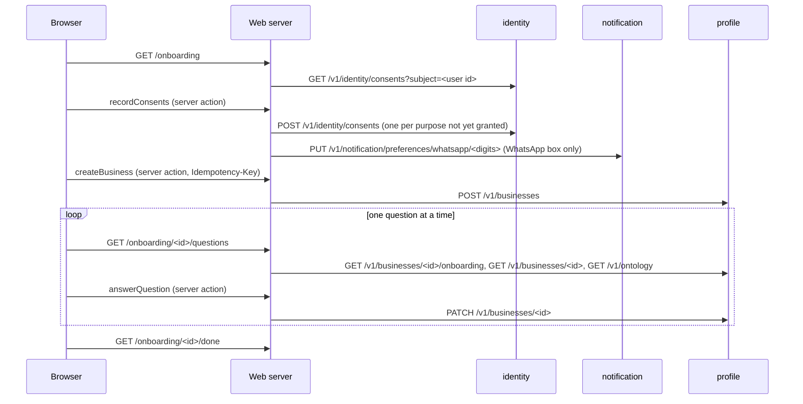

# Onboarding flow

How a new owner, staff member or CA-firm user gets from signing in to a business profile the
applicability engine can evaluate: four steps under `/onboarding`, each a screen in the registry
(`owner.onboarding`, `owner.onboarding.business`, `owner.onboarding.questions`,
`owner.onboarding.done`), built on the identity consents, the profile service's business API and
the ontology. The client-level detail of each call (headers, caching, mapping) is in
[data-layer.md](data-layer.md); this page is the flow, what each step records, and why.

Who may onboard: `owner`, `staff`, `ca_admin` and `ca_staff`, in a `business` or `ca_firm`
tenant. A compliance lead reads businesses but is sent to `/forbidden` from these steps. A tenant
role lands on `/businesses` after signing in; the empty list links to `/onboarding` ("Get
started") and to `/onboarding/business` ("Add a business", or "Add a client" for a firm).

Every call goes from the web server with `x-tenant-id` from the session and an `x-request-id`
the error states show; the browser calls no service.

## 1. Consents: `/onboarding`

The page reads the user's consent records (`GET /v1/identity/consents?subject=<user id>`) and the
`Version:` line of each document in `docs/legal`, read at request time so the step always offers
what the running build ships.

- Required: the terms (`terms`), the privacy notice (`privacy_notice`) and the processing of the
  business profile (`profile_processing`). Optional, unticked: WhatsApp reminders (with a number
  in E.164, which appears when the box is ticked), email reminders, product analytics. Each box
  links to its document with its version.
- `recordConsents` records one row per ticked purpose that is not already granted at the current
  version, in that order: `subject` and `recorded_by` are the user id, `source` is
  `web_onboarding`, `notice_version` is `<document>@<Version line>`
  (`terms-of-service@0.1-draft`; the privacy notice's version for the privacy notice, profile
  processing, email reminders and analytics; the WhatsApp notice's for WhatsApp reminders), and
  `evidence` is the checkbox sentence word for word. D-026 explains the notice format.
- With the WhatsApp box ticked, the number is then opted in on the notification service
  (`opted_in: true`, `source: web_onboarding`), keyed by its digits without the plus, as the bot
  and WhatsApp key it, and remembered on this device for the settings pages
  (`cw_prefs_recipient`, see [settings.md](settings.md)).
- Records are append-only and each POST stands alone. A failure part-way says which purposes were
  recorded, and submitting again records only the rest. A user who already agreed at the current
  versions sees what was agreed and when, and a link on, instead of the form.
- While any document the step refers to is a draft, the draft banner names each one with its
  version: that is what a record carries.

## 2. The business: `/onboarding/business`

The form is offered only once the required purposes are granted at the current versions,
because the profile service does not check consents; otherwise the page points back to step 1.

- The person types a GSTIN (upper-cased and stripped of spaces, then matched against the
  kernel's pattern) and the name the business goes by, and optionally a name for the
  registration. `createBusiness` sends `POST /v1/businesses` with the `Idempotency-Key` the page
  rendered into the form (`profile.create-business`), so a double submit records one business.
- The business is made from the PAN inside the GSTIN. The same PAN again answers "already in your
  account" with the same business.
- The answer stays on screen before the flow moves on (D-028): what the GSTIN lookup returned,
  worded by the ontology, and the attributes it stored, or, when no lookup answered, a plain note
  and the `verify_registration` review task the service opened. The profile service's built-in
  static lookup (`CW_PROFILE_GSTIN_LOOKUP=static`, as `make web-stack` runs it) knows one GSTIN,
  the demo `29ABCDE1234F1Z5`; every other GSTIN gets the plain note, and the page says so under
  the field. Nothing is ever invented to fill the panel.
- "Add another business" loads the page afresh, so the next form has a new key.

## 3. Questions: `/onboarding/[businessId]/questions`

One question at a time from the business API's checklist (`GET /v1/businesses/{id}/onboarding`,
which names the next open item and counts the answered ones), read with the business, the
ontology and the review tasks on its nodes.

- The question is the page's h1, as the checklist words it from the ontology (else the
  attribute's label), with its help line (else the attribute's definition); a per-year attribute
  names the financial year the answer is for. The control is
  chosen by the attribute's type (`AttributeControl`): a radio group, checkboxes, Yes and No, a
  whole or decimal number, a date or a text field.
- Three answers: Save (`known`, with the value), Not sure (`unsure`), Does not apply
  (`not_applicable`, which opens a review task an analyst will look at; the button says so).
  `answerQuestion` stores it with `PATCH /v1/businesses/{id}` on the node the checklist named,
  then redirects to the step with `?saved=<attribute key>` (a key, never a value) for the status
  line; focus moves to the new question.
- The checklist returns an unsure answer as the next question again, so the step keeps a skip
  list per business in the httpOnly cookie `cw_onboarding_skip_<businessId>` (path
  `/onboarding`, one day, written by server actions only) and walks the checklist past it
  (D-029). Clearing cookies only means the unsure questions are asked again.
- The progress bar is the checklist's own count: known and not-applicable answers count, unsure
  ones do not. "Stop here and see the summary" leaves at any point.

## 4. Summary: `/onboarding/[businessId]/done`

The business with its PAN and GSTINs, the checklist's counts, the questions answered Not sure
(with "Answer these now", which clears the skip list and starts again from the first of them),
the questions not answered yet, and the open review tasks with their reasons. It links to the
business's pages. Obligations are not shown yet: the first-obligation panel waits for the
obligation routes and is not built.

## A CA firm

A firm's user onboards each client the same way, with two differences: the consent step has no
WhatsApp box (reminders are set per client business, not for the firm; the step says so), and
the consents are recorded once for the user, not per client. The list at `/businesses` is the
firm's clients, with a search by name, PAN or GSTIN that is posted, never put in a URL.

## Closed in production while the legal documents are drafts

With `CW_WEB_ENV=prod`, while the terms or the privacy notice has a Version line ending in
`-draft`, steps 1 and 2 show the step's heading, the draft banner and each draft with its
version and link, and no form; `recordConsents` and `createBusiness` refuse before any call.
Local, test and staging stay open under the draft banner. The questions and the summary stay
open, because they change a business that exists. The rule and its reasons are in
[legal-pages.md](legal-pages.md) and D-035.

## Product events

When `web.analytics_enabled` is on and the person's analytics consent is current, the steps emit
`onboarding_step_completed` (`step: consent`; `step: business` with `created` and `looked_up`;
`step: question` with the attribute key and the answer's state, never its value) and each view of
the summary emits `onboarding_summary_viewed` with counts only. The flag is off by default, and
with it off nothing is read or written. The gate, the event list and the consent read are in
[feature-flags.md](feature-flags.md) and D-034.

## What waits

- The first obligation on the summary and the business home: the obligation read routes.
- The onboarding checklist cannot skip an unsure item itself; a skip or after parameter on
  `GET /v1/businesses/{id}/onboarding` would remove the cookie.
- The user's own phone number and email: `GET /v1/identity/me`. Until then the number is typed
  on the consent step and remembered per device.
