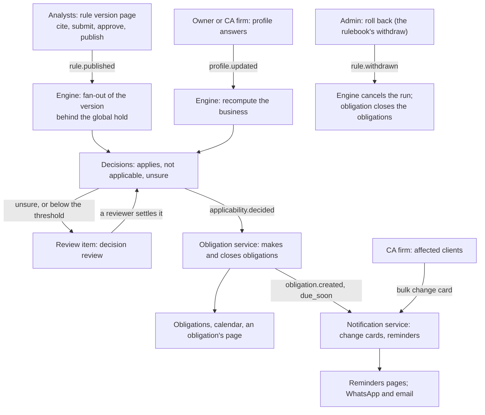

# The product loop

How a published rule reaches a business on screen: from the analyst's publication, through the
applicability engine's fan-out and decisions, to the obligations, the calendar, the change cards
and the reminders the owner and the CA firm see, with the internal tools the regulatory team
watches it with. Each step is a service's; the web app shows what each one recorded and decides
nothing itself. [obligation-pages.md](obligation-pages.md) has the owner's pages and
[admin-tools.md](admin-tools.md) the internal tools; [runbook-admin.md](runbook-admin.md) has the
operator's steps.

## The loop

1. **Publication.** Analysts cite a draft's clauses and take it through review on the rule version
   page (`/admin/rulebook/versions/[id]`); publishing writes `rule.published`.
2. **Fan-out.** The engine decides the version for every business of its level in its business
   directory, a batch of 1,000 at a time, stopping at each batch boundary while the global hold is
   set or a person paused the run (`docs/runbooks/fan-out-control.md`). A version that supersedes
   another compares each result with the old one; too many flips pause the run by itself.
3. **Decisions.** Each decision is applies, not applicable or unsure, with every condition's outcome
   and why. A condition in words nobody judged, or a judgement below the threshold, opens a review
   item. A profile change decides the business again for every version in force (the recompute).
4. **Obligations.** The obligation service makes the obligations of a decision that applies (the
   periods still due included) and closes them when a later decision does not apply, when the
   version is withdrawn or superseded, or when a person completes or waives one.
5. **Change cards and reminders.** The notification service sends a change card when an obligation
   is made, the reminder sweep sends `due_soon` reminders before a due date, and a CA firm can tell
   its affected clients' own people about a change in one request.

## What each step shows

| Step | Owner and CA screens | Internal tools |
| --- | --- | --- |
| Publication | the changes feed: what changed, its dates, approvers, citations | rule versions and their workflow |
| Fan-out | a change "Not decided for this business" until the run reaches it | fan-outs: status, counters, flips, the hold, the controls |
| Decisions | the badge on each obligation row and change card; "why this applies" on an obligation | decision review; the impact explorer's dry run before publishing |
| Obligations | the list, the calendar, an obligation's page with its tracking | none |
| Notifications | the reminders pages of a business; a CA firm's affected clients and its bulk card | the notification console |

## The oversight tools

- **Fan-outs** (`/admin/fan-outs`, every regulatory role reads): every version's run, newest first,
  under the global hold's banner. A version's page (`/admin/fan-outs/[id]`) shows the run's status
  in words, how far it got, its flips, who changed it last and why; an admin holds or releases every
  fan-out, pauses, resumes or cancels the run, and rolls the version back through the rulebook's
  withdraw (D-049, D-050).
- **Impact explorer** (`/admin/impact`, an admin): a dry run of a version in any status, or of a
  specification no version holds yet, over one tenant or every tenant: the counts by result, the
  attributes that decided them and sample decisions. It stores no decision.
- **Decision review** (`/admin/decisions`, every regulatory role reads, a reviewer or an admin
  settles): one tenant's review items, looked up by the tenant's id (D-051).
- **Affected clients** (`/changes/[id]/impact`, a CA firm's admin and staff): which clients a
  change affects and the bulk change card to their own people (D-052).

## On the local product

`make product` runs the loop end to end with the worker; `make product-seed` adds the synthetic
tenants and the demo publication, and `make product-check` proves each step (the fanout step
publishes the seed calendar's annual return behind the hold). The web app's product project
(`make product-e2e`) then walks it in the browser: the obligations of the seeded business, the
annual return's completed fan-out with the hold set and released, a dry run's counts, and a CA
firm's change card sent twice with one key. `make web-stack` has no worker, so there nothing fans
out and nothing becomes an obligation: its specs cover the screens' gates, empty states and the
hold.

## What waits

- Browsing review items across tenants: no route lists the tenants with open items.
- A web flag for the CA firm's bulk card: none; the notification service's own switch is shown as
  it answers.
- Naming the admin in the engine's audit rows: the engine reads no token in `header` mode, so a
  control is recorded as the system until identity issues tokens.
